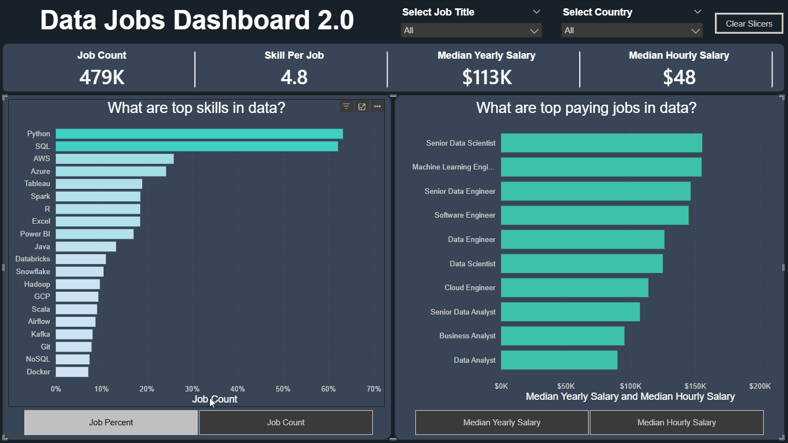

# Data Jobs Dashboard with Power BI V2

## Introduction

This dashboard (V2.0) helps users explore the data job market through a clean, single-page interface. Using 2024 job posting data (roles, salaries, locations), it enables job seekers and career transitioners to quickly understand market trends and compensation.

## Skills Showcased

* **Dashboard Design:** Creating an intuitive and visually appealing layout
* **Power Query (ETL):** Data cleaning, transformation, and shaping
* **Data Modeling:** Building efficient data models and relationships
* **DAX Fundamentals:** Developing calculations and aggregations

**Visualizations Utilized:**
* **Core Charts:** Column and bar charts for comparisons and trends
* **Cards:** Highlighting key KPIs

**Interactive Features:**
* **Slicers:** Dynamic filtering
* **Buttons:** Improved navigation and user experience

### Dashboard Overview

**You can find the dashboard file in the project folder:** [`Data_Jobs_Dashboard_V2`](./)

This updated version (V2.0) demonstrates how Power BI can transform raw job posting data into a **practical decision-making tool**. It enables users to explore market trends, filter insights dynamically, and better understand the data job landscape.