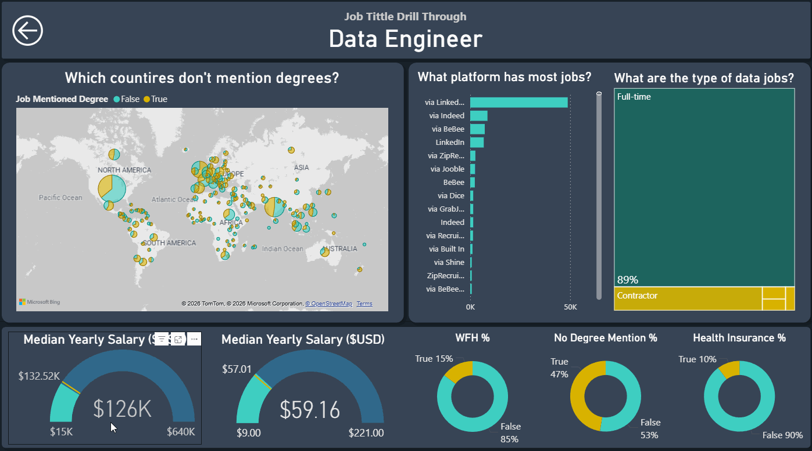

# Jobs Dashboard with Power BI

  

## Introduction

This dashboard is designed to help users explore the data job market in a simple and intuitive way. By slicing, filtering, and drilling down into the data, you can quickly spot patterns and answer real questions about salaries, roles, and trends in the data field.

You’ll find salary insights by job title, year, and hourly rate, with the ability to dig deeper depending on the role you’re interested in. The goal is to give you a clear picture of the market so you can make more confident, better-informed career decisions.

This project was created following a course by **Luke Barousse** — big thanks to him for the clear explanations and great learning material that made this dashboard possible.

### Dashboard File
You can find the file for the dashboard here: [`Data_Jobs_Dashboard.pbix`](Data_Jobs_Dashboard.pbix).  

## Skills Showcased

Through this project, I strengthened my Power BI skills and applied several core techniques, including:

* **Implicit Measures:** Used built-in metrics and statistical measures such as median, average, min, max, and quick measures to efficiently build the required visuals.
* **Core Charts:** Implemented visualizations like column, bar, line, gauge, and treemap charts to highlight trends and patterns.
* **KPI Indicators:** Designed KPIs to surface key metrics and add context to the analysis.
* **Dashboard Design:** Created a clean and visually appealing dashboard focused on storytelling and usability.
* **Interactive Reporting:**

  * **Slicers:** Enabled dynamic filtering by job title for focused exploration.
  * **Buttons & Bookmarks:** Built smooth navigation flows, allowing users to easily return from drill-through pages.
  * **Drill-Through:** Allowed navigation from high-level summaries to detailed, contextual views.

## Dashboard Overview

The report is split into two pages, making it easy to explore the job market at both a high level and in more detail.

### Page 1: High-Level Market View

  

This page provides an overall snapshot of the data job market. It highlights job trends for 2024, compares hourly and yearly salaries across data roles, identifies the highest-paying positions, and includes a comparison table showing trends for each job title.

### Page 2: Job Title Drill Through

  

This page allows the users to go deeper by selecting a field in the first page to drill through this page and show more specific details 

This page lets users dive deeper into specific roles. By selecting a job title on the first page, users can drill through to see more detailed and role-specific insights, enabling a more focused analysis.
